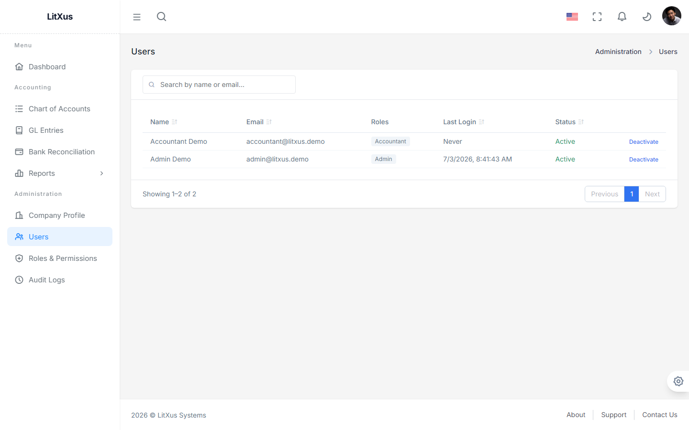
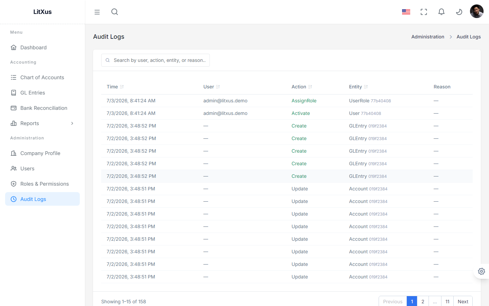

# Phase 1 — Admin & System Setup User Guide

This covers the hands-on side of Identity/RBAC, Company Profile, and Licensing —
the parts of Phase 1 that aren't Accounting itself but that a real deployment
needs before Accounting is usable. See [User_Guide.md](User_Guide.md) for the
Accounting workflow (Chart of Accounts, GL Entries, Reports).

**Note on sample data:** `UserSeeder` only creates two accounts
(`superadmin@litxus.demo`, `admin@litxus.demo`) so a fresh install has
something to log in with — it does not seed a regular "User"-tier account.
This guide creates one for real, by hand, the same way you'd do it for an
actual employee, rather than relying on seed data as a stand-in.

---

## 1. The Three Tiers

| Tier | Seeded account | What they can do |
|---|---|---|
| **Super Admin** | `superadmin@litxus.demo` | Everything, including License management. Install owner only. |
| **Admin** | `admin@litxus.demo` | Everything except License management — users, roles (view), company profile, audit logs, all Accounting. |
| **User** (e.g. Accountant) | *not seeded — created below* | Whatever their assigned role grants. No access to Administration pages. |

There are 7 fixed roles total (`Super Admin`, `Admin`, `Accountant`, `SalesUser`,
`InventoryManager`, `Manager`, `Viewer`) — see Section 6. Custom role creation
isn't built yet.

---

## 2. Super Admin: Applying a License Key

Log in as `superadmin@litxus.demo` / `Demo@12345`, go to **Administration →
License**. This is Super-Admin-only — an Admin account doesn't even see this
menu item.

The **Current License** card shows what's active (Product Code, Issued To,
Issued On, Expires On, Enabled Modules) — all of it derived from the signed
license token's claims, not separately editable fields. To change it, paste a
new signed token (generated via `backend/tools/LitXus.LicenseGenerator`, see
[17_License_Generator.md](../17_License_Generator.md)) into **Apply New
License Key** and submit. This takes effect immediately for every logged-in
user — no restart needed.

---

## 3. Admin: Onboarding a New User

Log in as `admin@litxus.demo` / `Demo@12345` for the rest of this section.

### Step 1 — the new person self-registers

There's no "create user" button for an Admin to click — a new account comes
from the person themselves visiting `/auth/register` and signing up (Full
Name, Email, Password). Once the system already has at least one user (which
it does, from seeding), a self-registered account starts **Pending**
(`isActive: false`) and has **no role** until an Admin acts on it.

### Step 2 — Admin activates the account

Go to **Administration → Users**. The new account appears with status
`Inactive`. Click **Activate**.

### Step 3 — Admin assigns a role

**Not yet available in the UI.** The Users page has no "Assign Role" button,
and the Roles & Permissions page is read-only (Section 6) — role assignment
only exists at the API level today
(`POST /api/v1/admin/users/{id}/roles`, body `{"roleId": "<role-guid>"}`,
requires `Admin.Users.Update`). Get the target role's GUID from
`GET /api/v1/admin/roles`, then call the assign endpoint with the new user's
ID. Until this happens, an activated user can log in but every action will be
rejected with 403 (no permissions).

This example assigns the `Accountant` role — `GL entries, tax, reports` (14
permissions) — a realistic User-tier role for someone doing day-to-day
bookkeeping.

---

## 4. Admin: Company Profile Setup

Go to **Administration → Company Profile**. This is what feeds the letterhead
on every financial report (see [User_Guide.md](User_Guide.md) §5) — company
name, SSM registration number, TIN, business type, MSIC code, financial
year-end, accounting framework (MPERS/MFRS), full address, and contact
details are all required fields.

Below the main form, **Authorized Signatories** lets you add the people
authorized to sign off on statutory filings (name, IC number, position,
email, phone) — click **+ Add Signatory**.

---

## 5. Admin: Reviewing Audit Logs

Go to **Administration → Audit Logs**. Every Create/Update/Delete — and
semantic actions like `AssignRole` and `Activate` — is captured automatically
with who, when, and (for updates) a before/after diff.

The two most recent rows above are literally the `Activate` and `AssignRole`
actions from Section 3, performed moments earlier — this page isn't sample
data, it's a live record of what an Admin actually did.

---

## 6. Admin: Roles & Permissions (read-only)

Go to **Administration → Roles & Permissions** to browse the 7 fixed roles
and what each grants. Super Admin itself is deliberately excluded from this
list (and from the Users list) — it's the install owner and isn't manageable
through the general admin UI.

No custom role creation or permission editing yet — this page is for
reference only in Phase 1.

---

## 7. User Tier: Logging In With Restricted Access

Log in as the newly-created account (`accountant@litxus.demo` in this
example) — `Demo@12345`. The sidebar reflects exactly what the `Accountant`
role grants: Accounting pages only, **no Administration section at all**.

Navigating directly to an admin URL (e.g. typing `/admin/users` into the
address bar) doesn't leak anything either — it redirects straight back to
`/dashboard`, the same way `/admin/license` is locked to non-Super-Admins.
This is enforced by an in-page guard on each admin page (not just by hiding
the sidebar link), since React Router's own `roles` field on route
definitions isn't actually consulted by the router.

---

## Not Yet Built

- **Assign/revoke role UI** — API-only today (Section 3). A settings screen
  is the natural next step.
- **Custom roles** — the 7 roles are fixed; no UI or API to create new ones.
- **Bulk user invite** — onboarding is one self-registration at a time.
