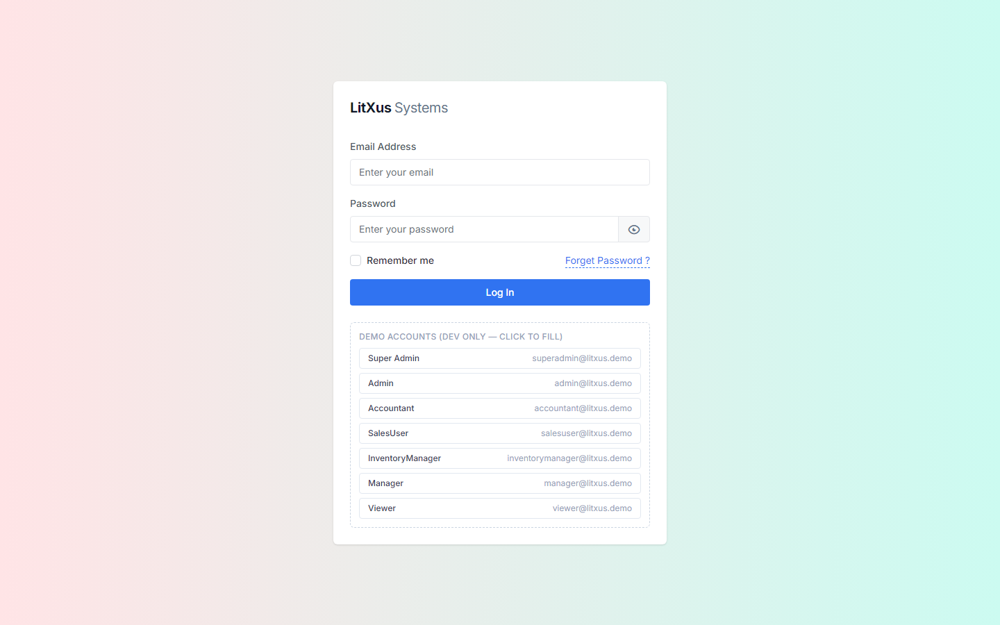
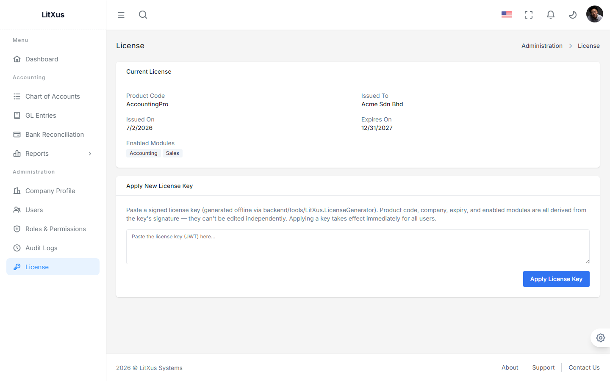
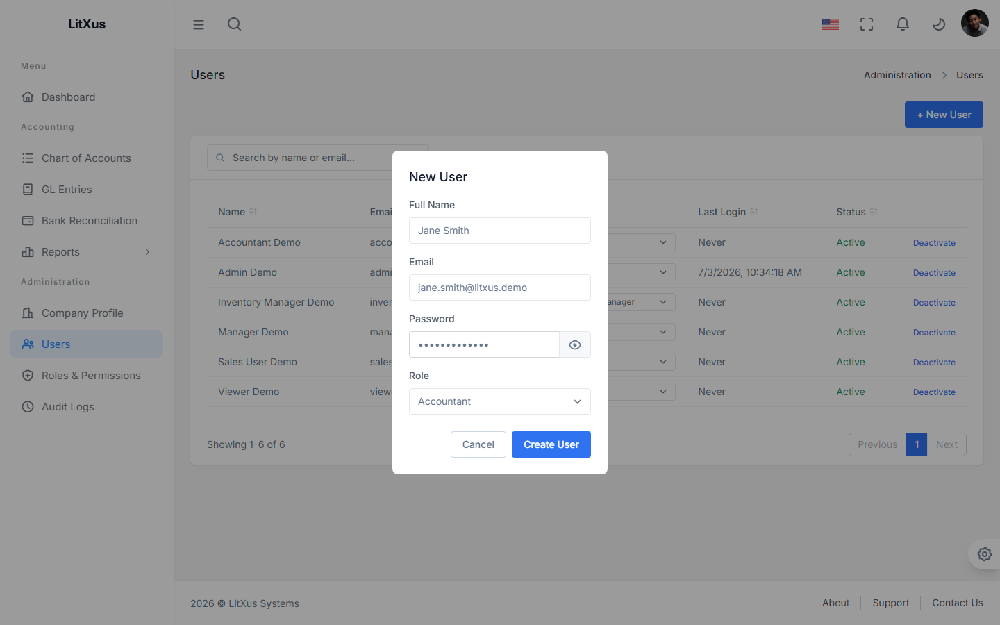
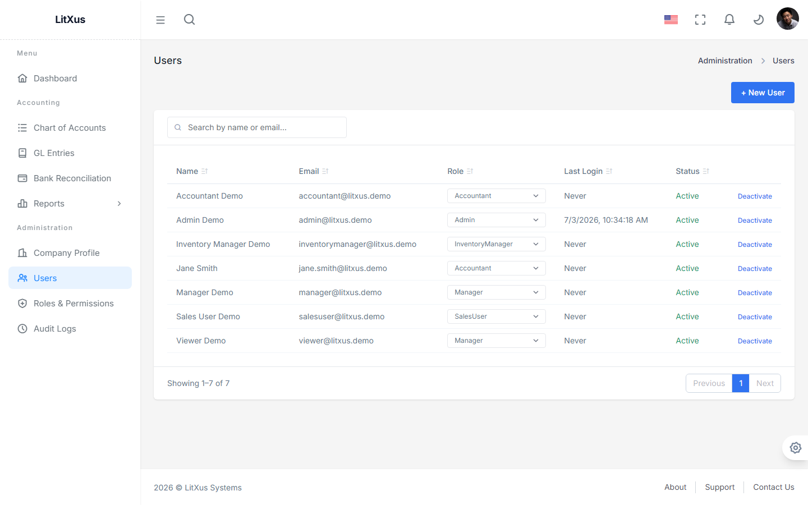
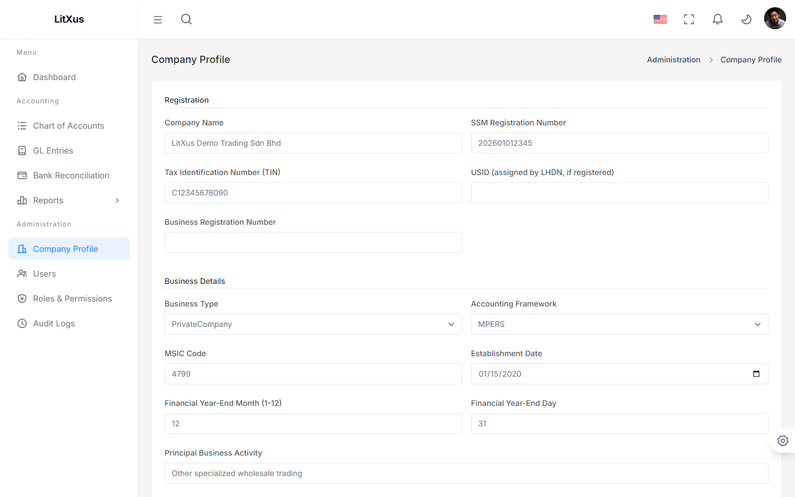
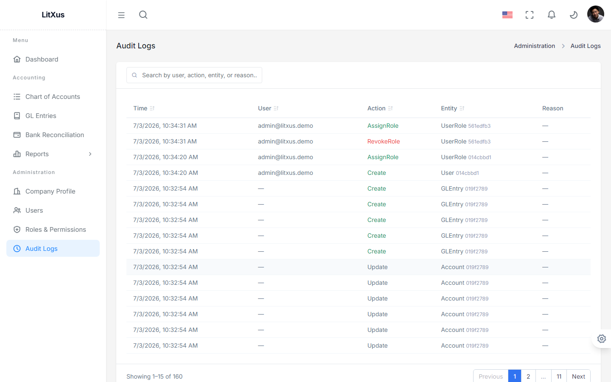
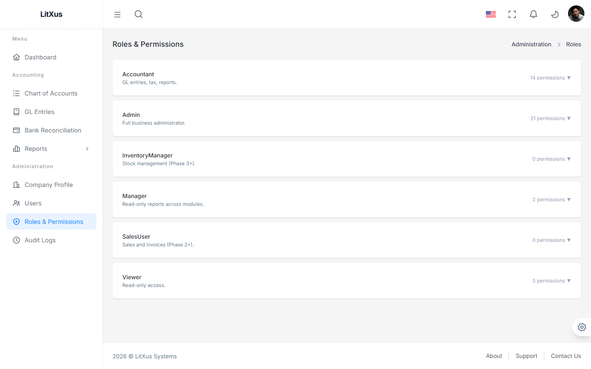
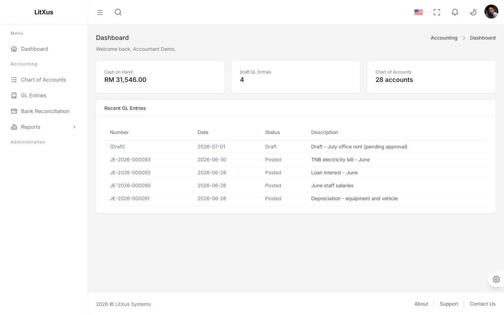

# Phase 1 — Admin & System Setup User Guide

This covers the hands-on side of Identity/RBAC, Company Profile, and Licensing —
the parts of Phase 1 that aren't Accounting itself but that a real deployment
needs before Accounting is usable. See [User_Guide.md](User_Guide.md) for the
Accounting workflow (Chart of Accounts, GL Entries, Reports).

**Note on sample data — this differs between dev and production:**
`UserSeeder` is demo-only (gated by `Seeding:Enabled`, off by default in
Production) and creates **one account per role — all 7** (`superadmin@litxus.demo`,
`admin@litxus.demo`, `accountant@litxus.demo`, `salesuser@litxus.demo`,
`inventorymanager@litxus.demo`, `manager@litxus.demo`, `viewer@litxus.demo`,
all password `Demo@12345`) purely so a **local dev/demo** install has a
ready-to-use login for every tier — it never runs in a real production
install. A real production install seeds **nothing**: the very first person
to hit `/auth/register` is automatically activated as Super Admin, and every
call after that is rejected (see [10_Deployment.md](../10_Deployment.md)
§10.3a) — from then on, every account is created directly by an Admin/Super
Admin via the UI (Section 3 below), active immediately, no separate
activation step.

---

## 1. The Three Tiers

| Tier | Seeded in dev/demo | In a real production install | What they can do |
|---|---|---|---|
| **Super Admin** | `superadmin@litxus.demo` | Not seeded — the first `/auth/register` account becomes Super Admin automatically | Everything, including License management. Install owner only. |
| **Admin** | `admin@litxus.demo` | Not seeded — created by the Super Admin, same as Section 3 | Everything except License management — users, roles, company profile, audit logs, all Accounting. |
| **User** (e.g. Accountant, Manager, Viewer) | `accountant@litxus.demo` and 4 others | Not seeded — created by an Admin/Super Admin, same as Section 3 | Whatever their assigned role grants. No access to Administration pages. |

There are 7 fixed roles total (`Super Admin`, `Admin`, `Accountant`, `SalesUser`,
`InventoryManager`, `Manager`, `Viewer`) — see Section 6. Custom role creation
isn't built yet.

In dev, the Login page lists all 7 demo accounts and fills the form for you
on click:

---

## 2. Super Admin: Applying a License Key

Log in as `superadmin@litxus.demo` / `Demo@12345`, go to **Administration →
License**. This is Super-Admin-only — an Admin account doesn't even see this
menu item.

The **Current License** card shows what's active (Product Code, Issued To,
Issued On, Expires On, Enabled Modules) — all of it derived from the signed
license token's claims, not separately editable fields. To change it, paste a
new signed token (generated via `backend/tools/LitXus.LicenseGenerator`, see
[17_License_Generator.md](../17_License_Generator.md)) into **Apply New
License Key** and submit. This takes effect immediately for every logged-in
user — no restart needed.

---

## 3. Admin: Creating a New User

Log in as `admin@litxus.demo` / `Demo@12345` for the rest of this section.
There is no self-registration step to walk through anymore — `/auth/register`
only ever works once, for the very first account on a fresh install (Section
1). Every account after that is created directly by an Admin/Super Admin.

### Create the account

Go to **Administration → Users** and click **+ New User**. Fill in Full Name,
Email, an initial Password, and pick a Role — Super Admin is never offered
here, only the 6 assignable roles.

Click **Create User**. The account is **Active immediately** with the chosen
role already assigned — no Pending state, no separate activation or
role-assignment step. They can log in right away with the password you set.

### Change an existing user's role

Each row's **Role** column is a dropdown, not read-only text — pick a
different role and it takes effect immediately (the old role is revoked and
the new one assigned in one action).

### Reset a locked-out user's password

There's no self-service "forgot password" — no email infrastructure exists
to deliver a reset link safely. If a user forgets their password, click
**Reset Password** on their row, enter a new password, and share it with
them directly (the same trust model as creating their account in the first
place). The change takes effect immediately.

---

## 4. Admin: Company Profile Setup

Go to **Administration → Company Profile**. This is what feeds the letterhead
on every financial report (see [User_Guide.md](User_Guide.md) §5) — company
name, SSM registration number, TIN, business type, MSIC code, financial
year-end, accounting framework (MPERS/MFRS), full address, and contact
details are all required fields.

Below the main form, **Authorized Signatories** lets you add the people
authorized to sign off on statutory filings (name, IC number, position,
email, phone) — click **+ Add Signatory**.

---

## 5. Admin: Reviewing Audit Logs

Go to **Administration → Audit Logs**. Every Create/Update/Delete — and
semantic actions like `Create` (a new user), `AssignRole`, and `RevokeRole` —
is captured automatically with who, when, and (for updates) a before/after
diff.

The top rows above are literally the account-creation and role-change actions
from Section 3, performed moments earlier — this page isn't sample data, it's
a live record of what an Admin actually did.

---

## 6. Admin: Roles & Permissions (read-only)

Go to **Administration → Roles & Permissions** to browse the 7 fixed roles
and what each grants. Super Admin itself is deliberately excluded from this
list (and from the Users list) — it's the install owner and isn't manageable
through the general admin UI.

No custom role creation or permission editing yet — this page is for
reference only in Phase 1.

---

## 7. User Tier: Logging In With Restricted Access

Log in as any User-tier account (`accountant@litxus.demo` in this example) —
`Demo@12345`. The sidebar reflects exactly what the `Accountant` role grants:
Accounting pages only, **no Administration section at all**.

Navigating directly to an admin URL (e.g. typing `/admin/users` into the
address bar) doesn't leak anything either — it redirects straight back to
`/dashboard`, the same way `/admin/license` is locked to non-Super-Admins.
This is enforced by an in-page guard on each admin page (not just by hiding
the sidebar link), since React Router's own `roles` field on route
definitions isn't actually consulted by the router.

---

## Not Yet Built

- **Custom roles** — the 7 roles are fixed; no UI or API to create new ones.
- **Bulk user invite** — onboarding is one account at a time.
- **Email-based invites** — the Admin sets the initial password directly and
  shares it out-of-band; there's no email infrastructure yet to send a
  set-your-own-password link instead.
