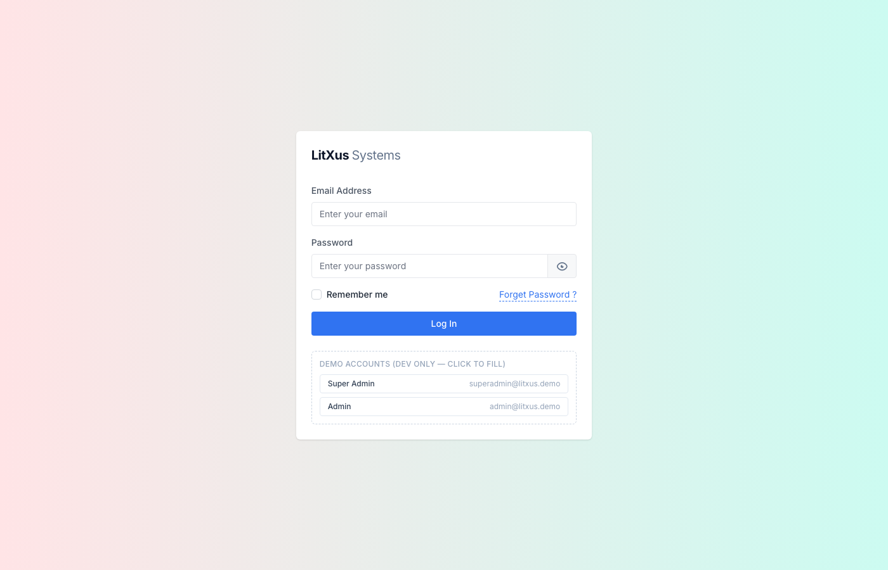
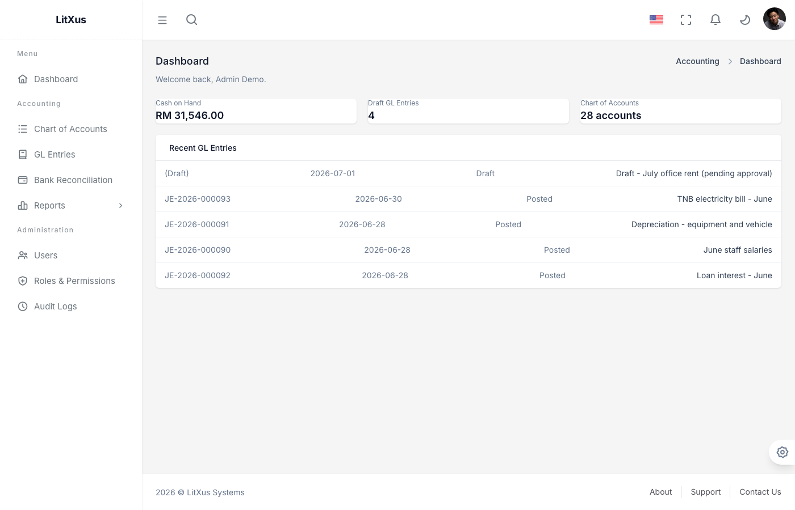
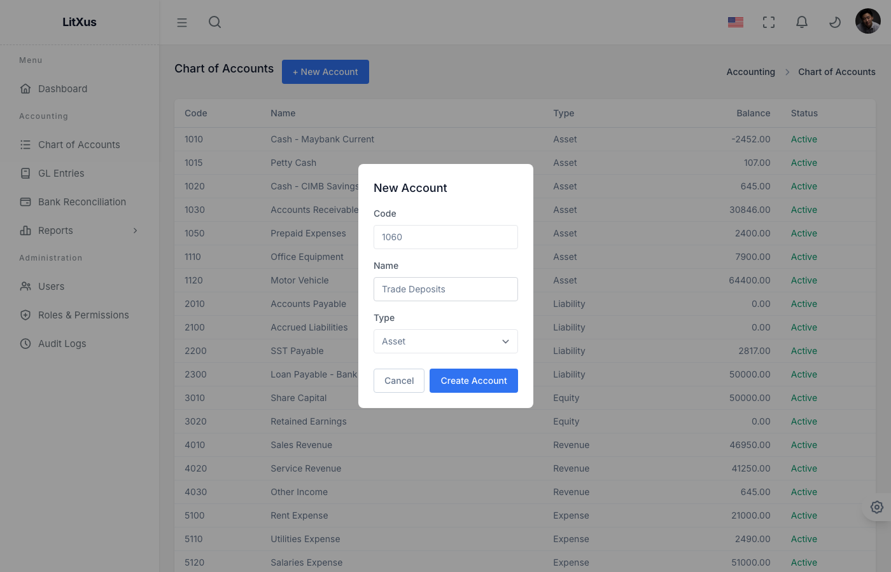
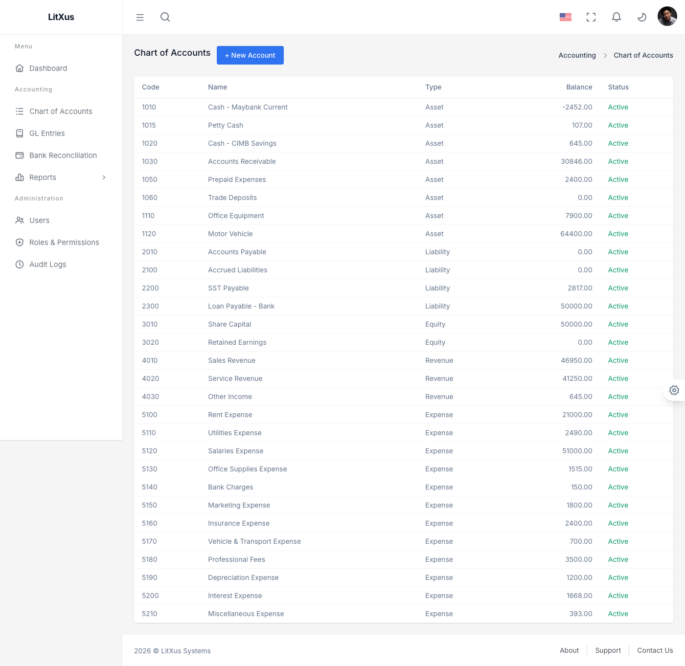
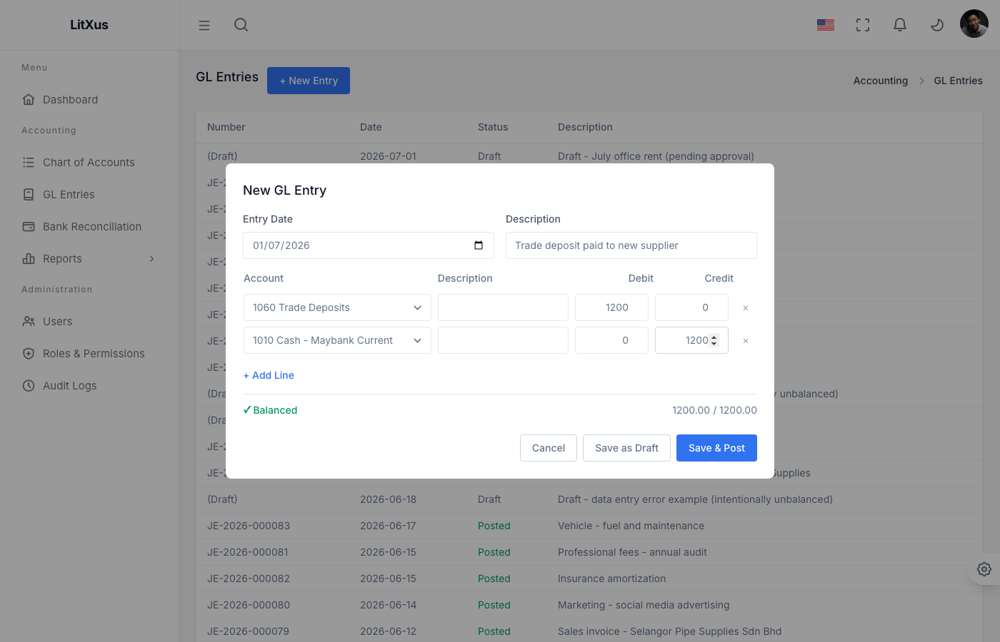
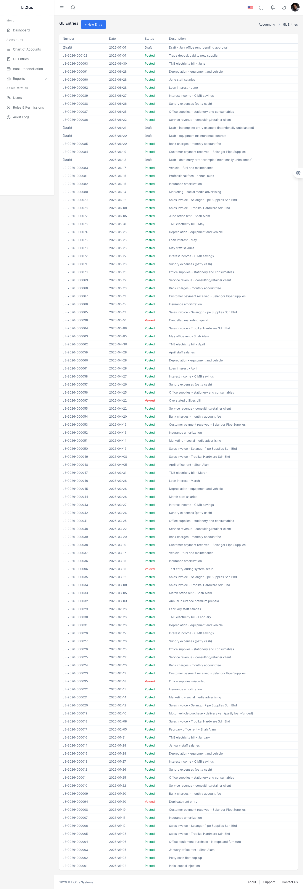
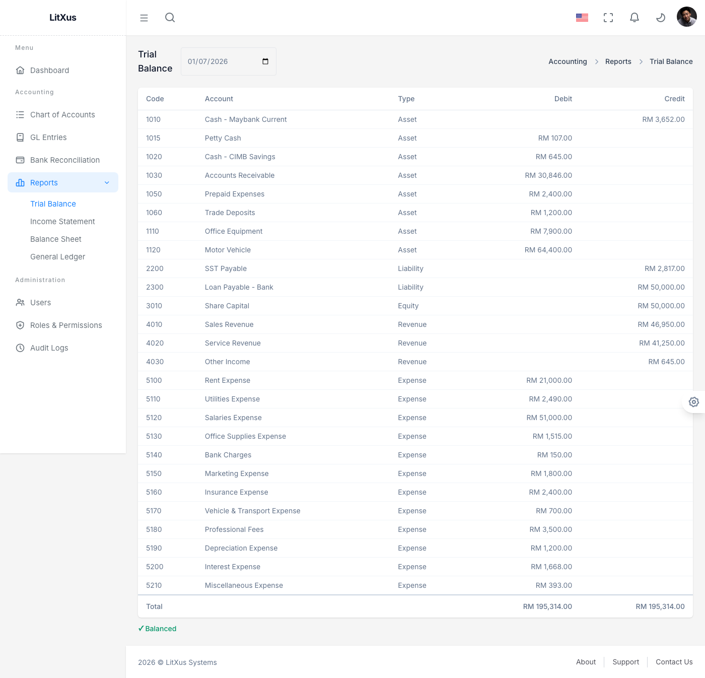

# Phase 1 — User Guide (Manual Data Entry)

This is a practical, click-by-click guide for a real user keying their own
data into LitXus Accounting Pro through the UI — as opposed to
[Sample_Data.md](Sample_Data.md), which describes the data the app
auto-generates on first run via `AccountingDemoDataSeeder`. Use this guide to
explore the app with your own numbers, or to onboard a new user.

Screenshots below were captured against a running local instance
(`admin@litxus.demo`) with the seeded demo dataset already loaded, so you'll
see existing rows in the tables alongside whatever you create.

---

## 1. Log In

Go to `/auth/login`. In non-production environments, a "Demo Accounts" panel
is shown below the form — click a row to auto-fill the email, then type the
password yourself (`Demo@12345`).

| Field | Notes |
|---|---|
| Email Address | Case-insensitive, must be an existing user |
| Password | — |

A `Pending` or deactivated account will be rejected with a clear message
instead of logging in — see [Business_Rules.md](../06_RBAC_Auth.md) for the
approval workflow.

---

## 2. Dashboard

After login you land on the Dashboard, which summarizes Cash on Hand, the
count of Draft GL Entries awaiting action, and the current size of your
Chart of Accounts, plus a feed of recent GL activity.

This page is read-only — it's your starting point, not a data-entry screen.

---

## 3. Chart of Accounts

Go to **Accounting → Chart of Accounts**. This is where you define every
account your GL entries will post to.

### Create an account

Click **+ New Account**. Fill in:

| Field | Rules |
|---|---|
| Code | Required, must be unique across all accounts |
| Name | Required |
| Type | One of Asset / Liability / Equity / Revenue / Expense — this determines whether the account is debit-normal or credit-normal (see [Business_Rules.md](../06_RBAC_Auth.md)) |

Click **Create Account**. On success the modal closes and the new row
appears in the table in code order.

**If the code is already taken**, the modal stays open and shows the exact
reason (e.g. *"An account with code '1060' already exists."*) so you can
correct it and resubmit — nothing is lost.

**Not yet available in the UI:** editing an existing account, deactivating
an account, and the parent/child tree view. The API supports edit and
deactivate (`PUT /accounting/accounts/{id}`, `POST
/accounting/accounts/{id}/deactivate`); a settings page to reach them from
the UI is still on the backlog.

---

## 4. GL Entries

Go to **Accounting → GL Entries**. This is the journal — every financial
event in the system is a balanced entry here.

### Create an entry

Click **+ New Entry**. Fill in:

- **Entry Date** and **Description** (top of the form)
- Two or more **lines**, each with an Account, an optional per-line
  description, and either a Debit or a Credit amount (not both)

Use **+ Add Line** for entries touching more than two accounts. The footer
tracks your running totals and flips between **✓ Balanced** and
**Not balanced** live as you type — you can't post an unbalanced entry.

You have two submit options:

| Button | Effect |
|---|---|
| **Save as Draft** | Saves the entry as `Draft` even if unbalanced. Editable later (via API — no edit UI yet). Doesn't affect account balances. |
| **Save & Post** | Disabled until the entry balances. Assigns the next sequential entry number (`JE-2026-NNNNNN`), posts it, and immediately updates account running balances. Posted entries are permanent — no UI edit path. |

If the save fails server-side (e.g. an inactive account was selected), the
modal now shows the error inline instead of closing silently.

**Not yet available in the UI:** posting a previously-saved Draft, and
voiding a Posted entry. Both exist at the API level
(`POST /accounting/gl-entries/{id}/post`,
`POST /accounting/gl-entries/{id}/void`) but have no button in this page yet
— see [Features.md](Features.md) Feature 4 for status.

---

## 5. Reports

Go to **Accounting → Reports**. All four reports read live from your Posted
GL entries — nothing here is manually entered, but they're the payoff for
the data you key in above.

| Report | What it shows |
|---|---|
| **Trial Balance** | Every account's net Debit/Credit as of a chosen date; must balance to RM 0 |
| **Income Statement** | Revenue − Expense over a date range |
| **Balance Sheet** | Assets = Liabilities + Equity as of a date, including computed Current Year Earnings |
| **General Ledger** | Line-by-line detail for one account over a date range, with a running balance |

Pick a later "as of" date to include entries you just posted — the example
above shows account `1060 Trade Deposits` carrying the RM 1,200.00 debit
from the entry created in Step 4, and the report still balances
(RM 195,314.00 both sides).

---

## 6. Administration (Admin/Super Admin only)

Go to **Administration → Users / Roles & Permissions / Audit Logs**.

- **Users**: view every user, activate/deactivate accounts. Role assignment
  is API-only for now (no UI button yet).
- **Roles & Permissions**: browse the 7 fixed roles and their permission
  grants (read-only in Phase 1 — no custom role creation yet).
- **Audit Logs**: every Create/Update/Delete on accounts, GL entries, users,
  roles is captured automatically. Click a row to expand the before/after
  diff.

These pages don't require any manual data entry — they reflect what the
system captured automatically from Sections 3–4 above. For a full hands-on
walkthrough of onboarding a new user (self-registration → activation → role
assignment), Company Profile setup, and License management, see
[Admin_Setup_User_Guide.md](Admin_Setup_User_Guide.md).

---

## Not Yet Built

For completeness, two Phase 1 features have no UI to key data into yet:

- **SST Tax calculation** — tax codes exist and are seeded, but there's no
  `/tax/calculate-sst` endpoint or admin page yet.
- **Bank Reconciliation** — the domain model exists, but there's no page to
  create bank accounts, import statement lines, or match them to GL entries.

Both are tracked in the Phase 1 backlog (see conversation/planning notes,
not yet reflected in [Features.md](Features.md) as separate backlog items).
