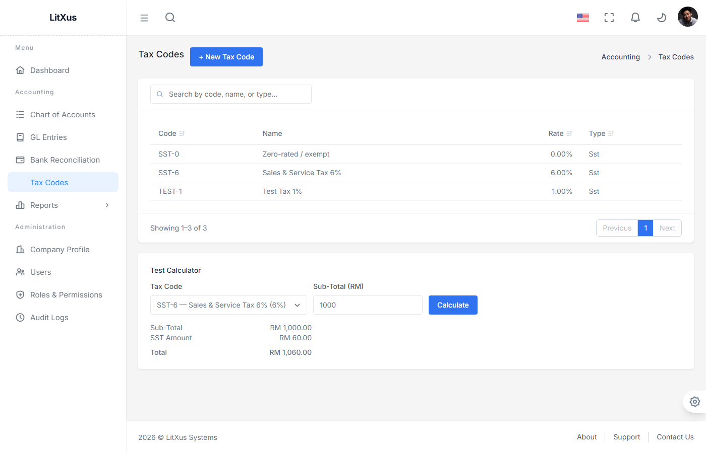
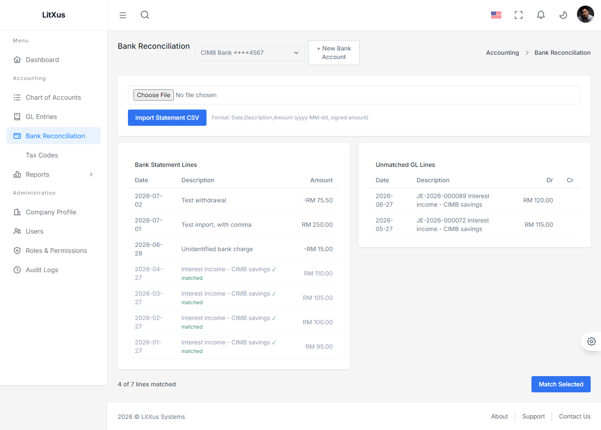

# Phase 1 — User Guide (Manual Data Entry)

This is a practical, click-by-click guide for a real user keying their own
data into LitXus Accounting Pro through the UI — as opposed to
[Sample_Data.md](Sample_Data.md), which describes the data the app
auto-generates on first run via `AccountingDemoDataSeeder`. Use this guide to
explore the app with your own numbers, or to onboard a new user.

Screenshots below were captured against a running local instance
(`admin@litxus.demo`) with the seeded demo dataset already loaded, so you'll
see existing rows in the tables alongside whatever you create.

---

## 1. Log In

Go to `/auth/login`. In non-production environments, a "Demo Accounts" panel
is shown below the form — click a row to auto-fill the email, then type the
password yourself (`Demo@12345`).

| Field | Notes |
|---|---|
| Email Address | Case-insensitive, must be an existing user |
| Password | — |

A `Pending` or deactivated account will be rejected with a clear message
instead of logging in — see [Business_Rules.md](../06_RBAC_Auth.md) for the
approval workflow.

---

## 2. Dashboard

After login you land on the Dashboard, which summarizes Cash on Hand, the
count of Draft GL Entries awaiting action, and the current size of your
Chart of Accounts, plus a feed of recent GL activity.

This page is read-only — it's your starting point, not a data-entry screen.

---

## 3. Chart of Accounts

Go to **Accounting → Chart of Accounts**. This is where you define every
account your GL entries will post to.

### Create an account

Click **+ New Account**. Fill in:

| Field | Rules |
|---|---|
| Code | Required, must be unique across all accounts |
| Name | Required |
| Type | One of Asset / Liability / Equity / Revenue / Expense — this determines whether the account is debit-normal or credit-normal (see [Business_Rules.md](../06_RBAC_Auth.md)) |
| Parent Account | Optional. Pick an existing account to nest this one under it — see below. |

Click **Create Account**. On success the modal closes and the new row
appears in the table in code order.

**If the code is already taken**, the modal stays open and shows the exact
reason (e.g. *"An account with code '1060' already exists."*) so you can
correct it and resubmit — nothing is lost.

The table shows accounts as a **tree** — a child account (one with a Parent
Account set) is listed immediately under its parent, indented with a `└`
marker, instead of everywhere sorted flatly by code. Clicking a sortable
column header (e.g. Balance) still works and simply flattens the view for
that sort; the tree order is just the default.

Each row also has **Edit** (rename the account and/or change its parent —
Code and Type can't be changed once created) and **Deactivate**/**Reactivate**.
A deactivated account is excluded from the active-accounts dropdown
everywhere else (e.g. when picking an account for a new GL entry line) and
hidden from the list by default — check **Show inactive accounts** above the
table to see and reactivate one.

Reparenting an account to one of its own descendants is rejected (*"This
would create a circular parent/child relationship."*) — the Parent Account
dropdown itself already excludes them as options, so this mostly guards
against a stale form submission.

---

## 4. GL Entries

Go to **Accounting → GL Entries**. This is the journal — every financial
event in the system is a balanced entry here.

### Create an entry

Click **+ New Entry**. Fill in:

- **Entry Date** and **Description** (top of the form)
- Two or more **lines**, each with an Account, an optional per-line
  description, and either a Debit or a Credit amount (not both)

Use **+ Add Line** for entries touching more than two accounts. The footer
tracks your running totals and flips between **✓ Balanced** and
**Not balanced** live as you type — you can't post an unbalanced entry.

You have two submit options:

| Button | Effect |
|---|---|
| **Save as Draft** | Saves the entry as `Draft` even if unbalanced. Doesn't affect account balances until posted. |
| **Save & Post** | Disabled until the entry balances. Assigns the next sequential entry number (`JE-2026-NNNNNN`), posts it, and immediately updates account running balances. |

If the save fails server-side (e.g. an inactive account was selected), the
modal now shows the error inline instead of closing silently.

A saved **Draft** row shows **Edit** and **Post** buttons. **Edit** reopens
the same form pre-filled with the entry's current date, description, and
lines — change anything and click **Save Changes** (or **Save & Post** to
update and post in one step). **Post** posts the entry as-is (the same
balance check applies; posting an unbalanced Draft shows the exact reason,
e.g. *"Entry is unbalanced by RM 50.00 (debit exceeds the other side)."*,
instead of failing silently). A **Posted** row shows a **Void** button, which
prompts for a reason before reversing the entry's balance impact. **Voided**
entries have no further actions — this is a terminal state.

---

## 5. Reports

Go to **Accounting → Reports**. All four reports read live from your Posted
GL entries — nothing here is manually entered, but they're the payoff for
the data you key in above.

| Report | What it shows |
|---|---|
| **Trial Balance** | Every account's net Debit/Credit as of a chosen date; must balance to RM 0 |
| **Income Statement** | Revenue − Expense over a date range |
| **Balance Sheet** | Assets = Liabilities + Equity as of a date, including computed Current Year Earnings |
| **General Ledger** | Line-by-line detail for one account over a date range, with a running balance |

Pick a later "as of" date to include entries you just posted — the example
above shows account `1060 Trade Deposits` carrying the RM 1,200.00 debit
from the entry created in Step 4, and the report still balances
(RM 195,314.00 both sides).

Every report has three export buttons next to its date filters:
**Export CSV** (downloads exactly what's on screen, opens cleanly in
Excel/Google Sheets), **Export PDF** (a print-ready copy with your company's
name, address, SSM and TIN in the header — the same letterhead shown above,
suitable for sharing with an auditor or bank), and **Export Excel** (an
`.xlsx` workbook with the same figures, for further analysis).

---

## 6. Tax Codes (SST)

Go to **Accounting → Tax Codes**.

The two seeded codes (`SST-6` at 6%, `SST-0` for zero-rated/exempt sales)
cover most day-to-day use — click **+ New Tax Code** only if you need a
different rate (e.g. a future income-tax reference code).

**Scenario — calculate SST on a RM 1,000 sale:**

1. In the **Test Calculator** panel, pick `SST-6` and enter `1000` as the
   Sub-Total.
2. Click **Calculate**. You'll see SST Amount `RM 60.00` and Total
   `RM 1,060.00`.
3. Rounding is 2dp, away-from-zero — try `2.50` at a 1% rate and you'll get
   `RM 0.03`, not the `RM 0.02` a naive banker's-rounding implementation
   would produce (the exact midpoint RM 0.025 always rounds up).

This calculator is the same `ISstCalculator` service a future Sales invoice
line will call — the tax codes you create here are ready to use once that
module ships.

---

## 7. Bank Reconciliation

Go to **Accounting → Bank Reconciliation**.

**Scenario — reconcile a Maybank statement:**

1. If no bank account exists yet, click **+ New Bank Account**, pick the
   linked GL account (e.g. `1010 Cash - Maybank Current`), and enter the
   bank name and account number.
2. Prepare a CSV with a header row `Date,Description,Amount` — dates as
   `yyyy-MM-dd`, amounts signed (positive for a deposit, negative for a
   withdrawal). Choose the file and click **Import Statement CSV**.
   If any row is malformed, the whole file is rejected with every bad row
   listed — nothing is partially imported.
3. The left pane shows statement lines (already-matched ones are greyed out
   with a ✓); the right pane shows unmatched Posted GL entry lines for that
   account. Click one row in each pane, then **Match Selected**.
4. The "X of Y lines matched" status updates immediately, and both matched
   rows drop out of their "unmatched" pools.

Only `Posted` GL entry lines are eligible for matching (a Draft entry has no
real ledger impact yet), and a GL line already claimed by another statement
line can't be matched again — both are enforced server-side, not just by
the UI hiding already-matched rows.

Matched the wrong pair by mistake? Click **Unmatch** on the statement line's
row — it goes back to unreconciled and the GL line becomes available to
match again.

---

## 8. Administration (Admin/Super Admin only)

Go to **Administration → Users / Roles & Permissions / Audit Logs**.

- **Users**: view every user, activate/deactivate accounts, change a user's
  role via the dropdown on each row.
- **Roles & Permissions**: browse the 7 fixed roles and their permission
  grants (read-only in Phase 1 — no custom role creation yet).
- **Audit Logs**: every Create/Update/Delete on accounts, GL entries, users,
  roles is captured automatically. Click a row to expand the before/after
  diff.

These pages don't require any manual data entry — they reflect what the
system captured automatically from Sections 3–7 above. For a full hands-on
walkthrough of onboarding a new user, Company Profile setup, and License
management, see [Admin_Setup_User_Guide.md](Admin_Setup_User_Guide.md).
