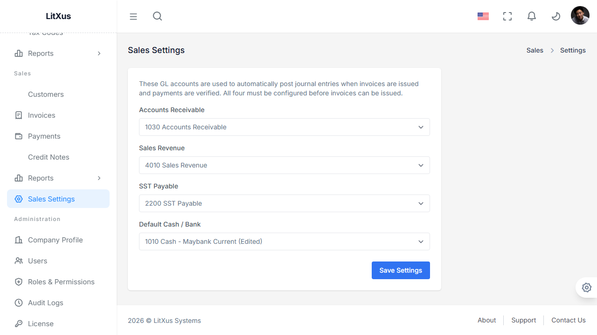
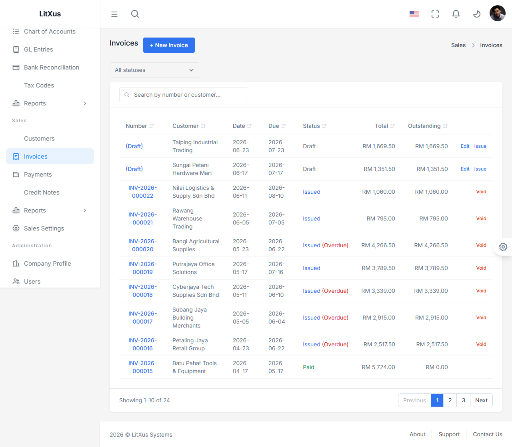
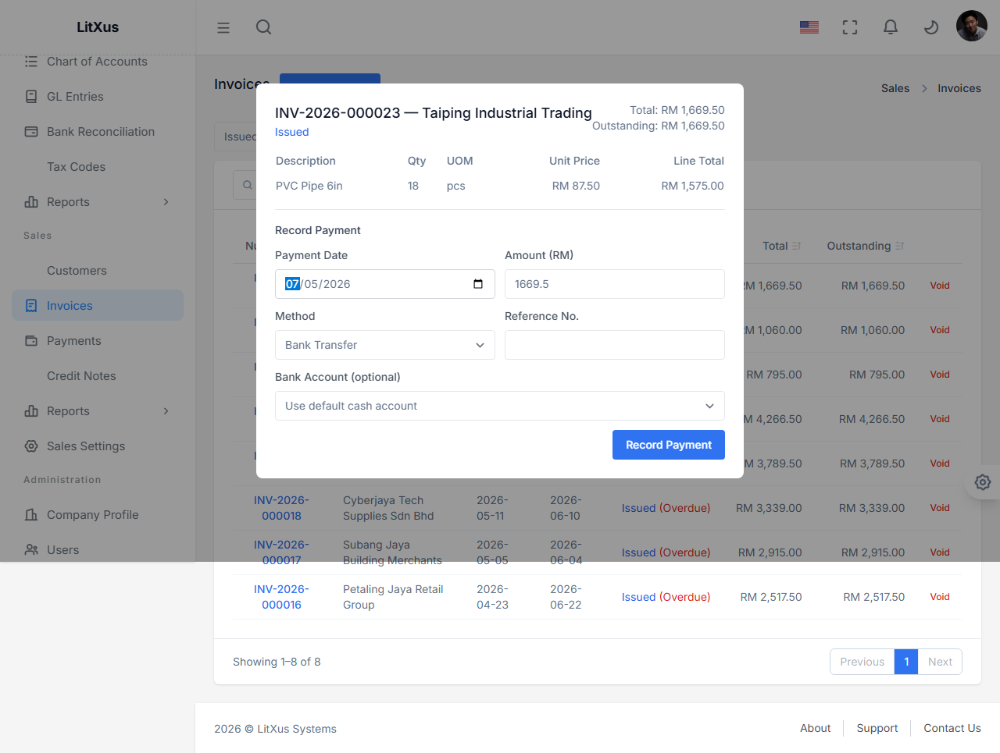
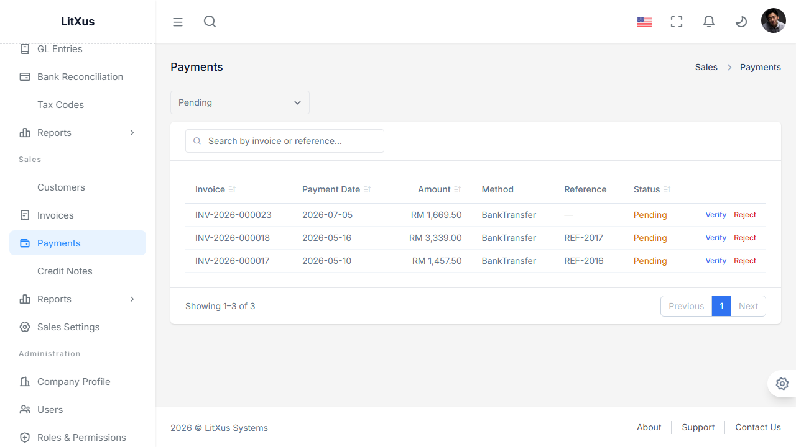
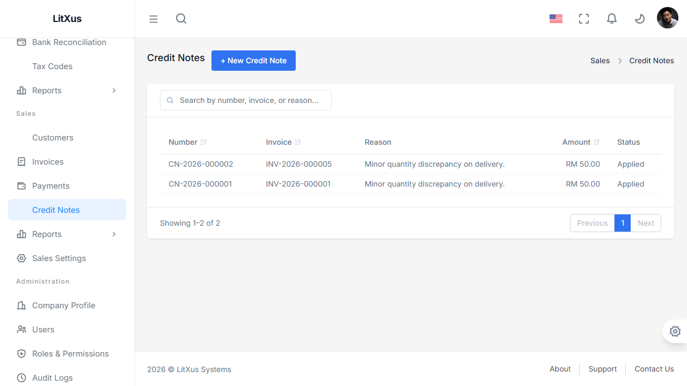
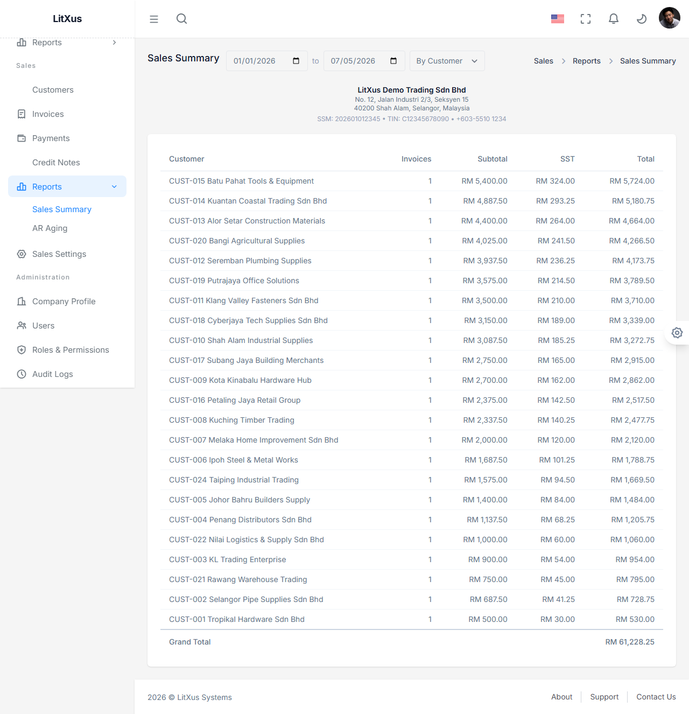
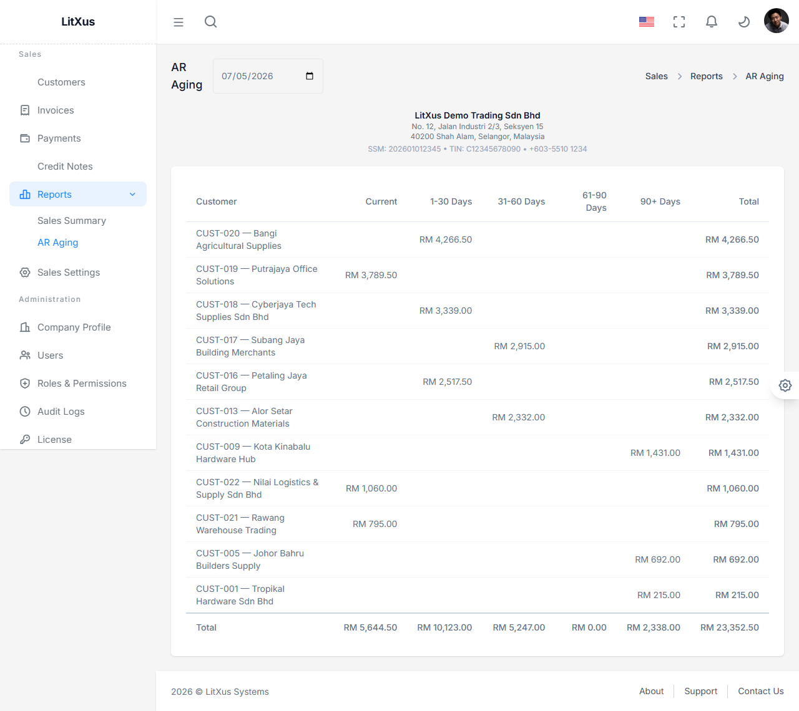

# Phase 2 — User Guide (Manual Data Entry)

A practical, click-by-click guide for a real user working the Sales module through the UI — as opposed to [Sample_Data.md](Sample_Data.md), which describes the data `SalesDemoDataSeeder` auto-generates on first run. Screenshots below were captured against a running local instance (`superadmin@litxus.demo`) with the seeded demo dataset already loaded.

---

## Prerequisites

1. Log in at `/auth/login` (`superadmin@litxus.demo` / `Demo@12345` in a dev instance).
2. Your license must include the `Sales` module, or the "Sales" nav section and every `/sales/*` endpoint will be unreachable (403).
3. Before any invoice can post to the ledger, an Admin must configure **Sales Settings** once (see step 1 below).

---

## 1. Configure Sales Settings (one-time, Admin)

Go to **Sales → Sales Settings**. Pick the 4 GL accounts that Sales auto-posting will use: Accounts Receivable, Sales Revenue, SST Payable, and a default Cash/Bank account. Click **Save Settings**.

Until all 4 are set, issuing an invoice will still succeed (the invoice itself doesn't require Accounting), but no GL entry will be created for it — the posting handler throws internally rather than blocking the sale.

---

## 2. Scenario: Bill a customer for a taxed sale

**Business scenario:** Taiping Industrial Trading Sdn Bhd orders 18 units of PVC Pipe 6in at RM 87.50 each, subject to 6% SST.

### Create the customer (skip if already exists)

Go to **Sales → Customers → + New Customer**. Fill in Code (e.g. `CUST-042`), Company Name, and optionally contact details, credit limit, and payment terms. Code cannot be changed later.

### Create the invoice

Go to **Sales → Invoices → + New Invoice**:

| Field | Sample value |
|---|---|
| Customer | Taiping Industrial Trading Sdn Bhd |
| Invoice Date | Today |
| Due Date | Today + 30 days |
| Line 1: Description | PVC Pipe 6in |
| Line 1: Qty | 18 |
| Line 1: UOM | pcs |
| Line 1: Unit Price | 87.50 |
| Line 1: Tax | SST-6 (6%) |

The footer shows Subtotal RM 1,575.00, SST RM 94.50, Total RM 1,669.50. Click **Save as Draft**.

### Issue it

Back in the invoice list, filter by **Draft**, find your new invoice, and click **Issue**. It's assigned a number (`INV-2026-000023` in this run) and flips to **Issued**.

**Accounting impact:** issuing posts a `Posted` GL entry automatically — Dr Accounts Receivable RM 1,669.50 / Cr Sales Revenue RM 1,575.00 / Cr SST Payable RM 94.50. Check **Accounting → GL Entries** to see it (`Source: SalesAutoPost`).

---

## 3. Scenario: Record and verify a payment

Click the invoice number to open its detail view.

### Record the payment (any Sales user)

Fill in **Record Payment**: Payment Date, Amount (defaults to the full outstanding balance), Method, optional Reference Number, optional Bank Account. Click **Record Payment**.

This creates a payment in **Pending** status — the invoice's Outstanding balance does **not** change yet. This is deliberate: an unconfirmed bank transfer shouldn't be booked as collected revenue.

### Verify the payment (Admin only)

Go to **Sales → Payments**, filter by **Pending**.

Click **Verify** on the row. Now:
- The invoice's Status flips to **Paid** (or **PartiallyPaid** if the amount was less than the full outstanding balance) and its Outstanding balance drops.
- **Accounting impact:** a second GL entry posts automatically — Dr Cash (or the linked bank account) / Cr Accounts Receivable, for the verified amount.

If the payment turns out to be invalid (e.g. bounced), click **Reject** instead and supply a reason — the invoice is left completely untouched.

---

## 4. Scenario: Issue a credit note for a partial return

**Business scenario:** the customer returns 3 damaged units after the invoice above was partially paid, and needs a credit.

Go to **Sales → Credit Notes → + New Credit Note**:

| Field | Sample value |
|---|---|
| Invoice | the invoice from above (only invoices with outstanding balance are listed) |
| Reason | "3 units damaged in transit" |
| Amount | RM 262.50 (3 × 87.50) |

Click **Create Credit Note**. It's assigned a number (`CN-2026-000003`) and applied immediately — the invoice's outstanding balance drops by RM 262.50. If you enter an amount greater than the invoice's current outstanding balance, the request is rejected outright with no partial effect.

Credit notes do **not** currently post to the GL — this is a known, deliberate gap for this phase (see Business_Rules.md).

---

## 5. Reports

**Sales → Reports → Sales Summary** — group by Customer, Product, or Month, over a date range.

**Sales → Reports → AR Aging** — outstanding balances bucketed Current / 1-30 / 31-60 / 61-90 / 90+ days overdue, as of a chosen date.

---

## Verification Checklist

- [ ] Sales Settings configured with all 4 accounts
- [ ] A customer created and visible in the list
- [ ] An invoice created, issued, and a matching `SalesAutoPost` GL entry visible in GL Entries
- [ ] A payment recorded (invoice unchanged), then verified (invoice status/outstanding updates, a second GL entry posts)
- [ ] A credit note created against an invoice with outstanding balance, reducing it correctly
- [ ] Sales Summary and AR Aging reports both render with real numbers
- [ ] A `SalesUser` account gets 403 attempting to Verify a payment or Issue/Void an invoice, but can still create customers/invoices/payments
